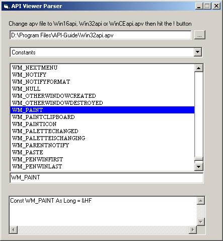



## API Viewer Parsing Engine

### Description

Don't have API Viewer freeware program? Don't bother downloading this. However, should you need or want to parse the API Viewer apv files from your code, a module is included in the zip. The parsing engine is fast & pretty well designed. The included interface to show a way of using the engine is not finished & no plans on finishing it. Required: API Viewer *.apv files (not included in zip)
 
### More Info
 

             |
---                |---
**Submitted On**   |2005-03-25 00:21:44
**By**             |[LaVolpe](https://github.com/Planet-Source-Code/PSCIndex/blob/master/ByAuthor/lavolpe.md)
**Level**          |Intermediate
**User Rating**    |5.0 (45 globes from 9 users)
**Compatibility**  |VB 6\.0
**Category**       |[Data Structures](https://github.com/Planet-Source-Code/PSCIndex/blob/master/ByCategory/data-structures__1-33.md)
**World**          |[Visual Basic](https://github.com/Planet-Source-Code/PSCIndex/blob/master/ByWorld/visual-basic.md)
**Archive File**   |[API\_Viewer1867893252005\.zip](https://github.com/Planet-Source-Code/lavolpe-api-viewer-parsing-engine__1-59632/archive/master.zip)

